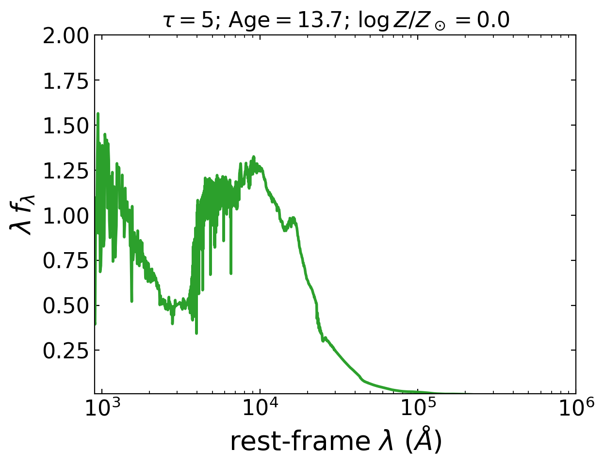

# Summary

Some words about FSPS generally, citing the literature [@fsps1; @fsps2; @fsps3].

# Statement of need

Some words about why Python and the impact of the Python bindings.

# Example usage

Give some examples and maybe a figure (\autoref{fig:example}) describing the
usage.

# Acknowledgements

Add acknowledgements.

Besides the software cited above, `python-fsps` is also built on top of `NumPy`
[@numpy] and others?

# References
